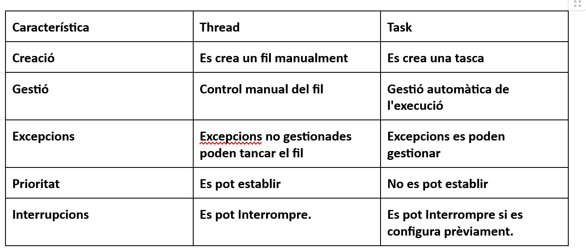

Investigació sobre la llibreria System.Diagnostics

La llibreria System.Diagnostics és una llibreria que permet interactuar amb processos, esdeveniments i contadors del nostre sistema operatiu. A continuació, es detallen les classes més rellevants i els seus mètodes i propietats útils:
Classes destacades

    EventLog: Permet llegir, crear i eliminar diferents esdeveniments, fonts i permisos.
        Mètodes a destacar:
            WriteEntry(string message): Escriu una entrada en el registre d'esdeveniments.
        ReadEntry(string message): Llegeix una entrada en el registre d'esdeveniments.

    Process: Permet monitoritzar i gestionar processos del sistema (farem servir aquesta principalment).
        Mètodes a destacar:
            Start(): Inicia un nou procés.
        Kill(): Elimina el procés immediatament.
        GetProcesses(): Retorna tots els processos que s'estan executant.

    Trace: Permet fer seguiments dels esdeveniments i gestionar l'execució de codi amb ells.
        Mètodes a destacar:
            Flush(): Neteja totes les dades de la cua d'un listener en concret.

Execució d'un navegador

Executa un programa de navegador (Edge, Chrome, Firefox). Fent servir la classe ProcessThread, crea un mètode que llista els fils que té el navegador i imprimeix el seu ID, hora d'inici i prioritat. Si obres més d'una pestanya, s'obren nous fils? Explica què succeeix.

Normalment, en els navegadors moderns, quan crees una pestanya nova, pot ser tant un procés com un fil, depenent de la configuració de cada navegador. Per exemple, Chrome, que deixa poca configuració a l'usuari, cada pestanya serà quasi sempre un nou procés. En canvi, Firefox pot configurar que, depenent del tipus de pestanya, pot agrupar diverses pestanyes en un mateix procés, passant així a ser fils.
Investigació sobre la classe Thread

La classe Thread permet crear i controlar la seva execució. A continuació, es detallen els mètodes més destacats:

    Mètodes a destacar:
        Start(): Inicia l'execució del fil.
        Join(): Espera que el fil acabi la seva execució.
        Sleep(int milliseconds): Suspèn l'execució del fil actual durant un període de temps especificat.
        Priority: Propietat que permet establir o obtenir la prioritat del fil.

Comparativa entre Thread i Task

Crea un programa amb 5 fils que escriuen per consola:
“Hola! Soc el fil número {numeroFil}”

Executa els 5 fils i comprova l'ordre que s'imprimeix. Quin és? I per què és aquest ordre?

L'ordre és el següent:

    4
    2
    1
    3
    5

La causa d'això és que estem fent servir Windows. Concretament, els fils s'executen de manera concurrent, el que significa que poden ser executats en paral·lel o de forma intercalada. El sistema operatiu és qui decideix quan i durant quant temps cada fil s'executa, basant-se en la seva política de programació.